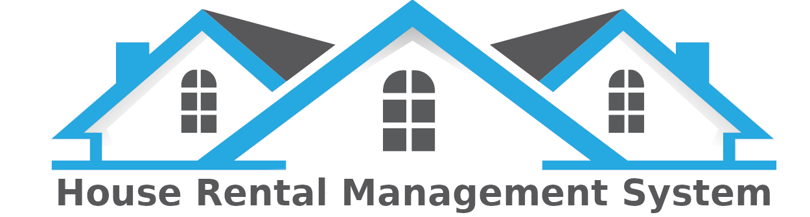

##  <center>House Rental Manegment System (HRMS) REST API</center>

## Overview
The HRMS is an REST API to manage the tenant in my house.HRMS is build on laravel framework


## [HRMS front-end](https://github.com/mirsahib/Project-Whirlpool-frontend.git)


### Requirements

- Laravel 7
- Passport
- Composer
- Artisan

### Installation
Step 1: Clone the repository
```
git clone https://github.com/mirsahib/Project-Whirlpool-backend.git
```
Step 2 : Download the required package 

Step 3 : Run the command below 

```sh
$ composer update
$ php artisan migrate
$ php artisan storage:link
```

Step 4 :    
 - Create copy of .env.example with name .env.(For this you can run the following command)
```
copy .env.example .env 
 ```
 - This is your environment file which is required by laravel project

 - Open .env file and update this file with the code below

 ```
 DB_CONNECTION=mysql
DB_HOST=127.0.0.1
DB_PORT=3306
DB_DATABASE=project-whirlpool
DB_USERNAME=root
DB_PASSWORD=
 ```
- Make sure you have a database name project-whirlpool

- After that run following command

```
php artisan key:generate
php artisan config:cache
composer dump-autoload
```
- After that run your migration commands
```
php artisan migrate
```

- Now Run your project with following command
```
php artisan serve
```


## Api

### HTTP requests
All API requests are made by sending a secure HTTPS request using one of the following methods, depending on the action being taken:

* `POST` Create a resource
* `PUT` Update a resource
* `GET` Get a resource or list of resources
* `DELETE` Delete a resource


### Houses
| Type | URL | Parameter | Body | Response | Description
| --- | --- | ---| --- | --- | --- |
| `GET` | `/api/houses` | **none** | **none** | return all houses
| `GET` | `/api/houses/{id}` | **id** - Identifier for current tenant  | **none** | return specific house
| `POST`  |  `/api/houses/create` | **none** |  | **none** | on successful response create new house
| `GET` | `/api/houses/{id}/edit` | **id** - Identifier for current house | **none** | return specific house
| `PUT/PATCH` | `/api/houses/{id}` | **id** - Identifier for current house |  | none
| `DELETE` | `api/houses/{id}` | **id** - Identifier for current house | **none** | **none**


### Tenants

| Type | URL | Parameter | Body | Response | Description
| --- | --- | ---| --- | --- | --- |
| `GET` | `/api/tenants` | **none** | **none** | return all tenants
| `GET` | `/api/tenants/{id}` | **id** - Identifier for current tenant  | **none** | return specific tenant
| `POST`  |  `/api/tenants/create` | **none** | <ul><li>name</li><li>nid</li><li>nid_img</li><li>phone</li><li>rent</li><li>reg_date</li></ul> | **none** | on successful response create new tenant with name,nid(national id),nid_img(national id photo),phone number,rent,date of renting the house
| `GET` | `/api/tenants/{id}/edit` | **id** - Identifier for current tenant | **none** | return specific tenant
| `PUT/PATCH` | `/api/tenants/{id}` | **id** - Identifier for current tenant | <ul><li>name</li><li>nid</li><li>nid_img</li><li>phone</li><li>rent</li><li>rent</li><li>reg_date</li></ul> | none
| `DELETE` | `api/tenants/{id}` | **id** - Identifier for current tenant | **none** | **none**

### Payment 
| Type | URL | Parameter | Body | Response | Description
| --- | --- | ---| --- | --- | --- |
| `GET` | `/api/payments` | **none** | **none** | return all paid and unpaid rent
| `POST` | `/api/payments/create` | **none** | <ul><li>month</li><li>year</li></ul> | **none** | 
| `PUT/PATCH` | `api/payments/update/{id}` | **id** - Identifier for current payment |  | |


## License

The HRMS API is open-sourced software licensed under the [MIT license](https://opensource.org/licenses/MIT).
